# SF CLI and Salesforce Object Reference Guide

## Sports League Management System

This guide provides comprehensive information on using the Salesforce CLI (SF CLI) and Salesforce Object Reference effectively within the Sports League Management project.

## Table of Contents

1. [Project Overview](#project-overview)
2. [SF CLI Commands for Your Project](#sf-cli-commands-for-your-project)
3. [Custom Objects Structure](#custom-objects-structure)
4. [Salesforce Object Reference Integration](#salesforce-object-reference-integration)
5. [Practical SF CLI Workflows](#practical-sf-cli-workflows)
6. [Advanced SF CLI Usage](#advanced-sf-cli-usage)
7. [Best Practices](#best-practices)

## Project Overview

Your Sports League Management project is well-configured with:
- **Package Structure**: Core package (`sportsmgmt`) + Sport-specific packages (`sportsmgmt-football`)
- **API Version**: 58.0
- **Architecture**: SOLID principles with dependency injection
- **Testing**: Comprehensive Jest (LWC) and Apex test coverage (94% org-wide coverage)
- **Development Tools**: ESLint, Prettier, automated scripts

### Project Configuration Files
- `sfdx-project.json` - Package configuration
- `config/project-scratch-def.json` - Scratch org definition
- `package.json` - Node.js dependencies and scripts
- `.forceignore` - Files to exclude from deployments

### Project Architecture Overview

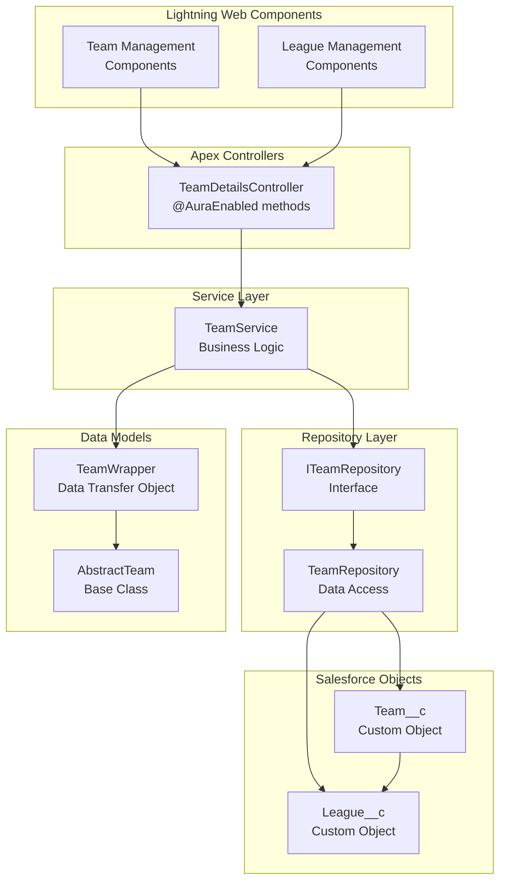

## SF CLI Commands for Your Project

### Project Management

```bash
# Deploy your entire project
sf project deploy start

# Deploy specific components
sf project deploy start --source-dir sportsmgmt/main/default/lwc
sf project deploy start --source-dir sportsmgmt/main/default/classes
sf project deploy start --source-dir sportsmgmt/main/default/objects

# Retrieve metadata from org
sf project retrieve start --source-dir sportsmgmt/main/default
sf project retrieve start --metadata CustomObject:Team__c,CustomObject:League__c
```

### Scratch Org Management

```bash
# Create scratch org (automated via your scripts)
sf org create scratch --definition-file config/project-scratch-def.json --alias sports-dev --duration-days 30

# Use your automated script (recommended)
node scripts/create-scratch-org.js sports-dev 30

# Open your scratch org
sf org open --target-org sports-dev

# List all orgs
sf org list

# Delete scratch org when done
sf org delete scratch --target-org sports-dev --no-prompt
```

### Testing and Quality

```bash
# Run Apex tests
sf apex test run --wait 10 --code-coverage --result-format human

# Run specific test classes
sf apex test run --tests TeamRepositoryTest,TeamServiceTest,TeamDetailsControllerTest --wait 10

# Run LWC tests (Jest)
sf force lightning lwc test run

# Run LWC tests in watch mode
sf force lightning lwc test run --watch

# Run with coverage
npm run test:unit
```

### Data Management

```bash
# Query your custom objects
sf data query --query "SELECT Id, Name FROM Team__c LIMIT 10"
sf data query --query "SELECT Id, Name, RecordType.Name FROM League__c"

# Query with relationships
sf data query --query "SELECT Id, Name, City__c, Stadium__c, League__r.Name FROM Team__c"

# Import/export data
sf data export tree --query "SELECT Id, Name FROM Team__c" --output-dir data/export
sf data import tree --plan data/league-team-plan.json

# Create records
sf data create record --sobject Team__c --values "Name='Test Team' City__c='Test City'"
```

## Custom Objects Structure

### Data Model Overview

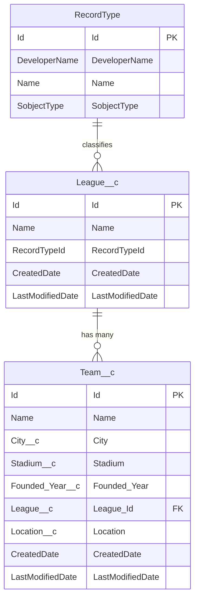

### 1. League__c (Parent Object)

**Purpose**: Represents sports leagues (NFL, MLS, etc.)

**Key Fields**:
- `Name` - League name (e.g., "National Football League")
- `RecordType` - Professional or Amateur league classification

**Relationships**:
- One-to-Many with `Team__c`

**Record Types**:
- `Professional` - Professional sports leagues
- `Amateur` - Amateur and recreational leagues

**Object Features**:
- History tracking enabled
- Reports and dashboards enabled
- Search enabled
- Bulk API enabled

### 2. Team__c (Child Object)

**Purpose**: Represents teams within leagues

**Key Fields**:
- `Name` - Team name (e.g., "Dallas Cowboys")
- `City__c` - Team's home city (Text, 100 chars)
- `Stadium__c` - Home stadium name (Text, 100 chars)
- `Founded_Year__c` - Year team was founded (Number, 4 digits)
- `League__c` - Lookup to League__c (required)
- `Location__c` - Geographic location information

**Relationships**:
- Many-to-One with `League__c` (Lookup relationship)
- Delete constraint: Restrict (prevents league deletion if teams exist)

**Object Features**:
- History tracking enabled
- Reports and dashboards enabled
- Search enabled
- Bulk API and Streaming API enabled

### Class Architecture Diagram

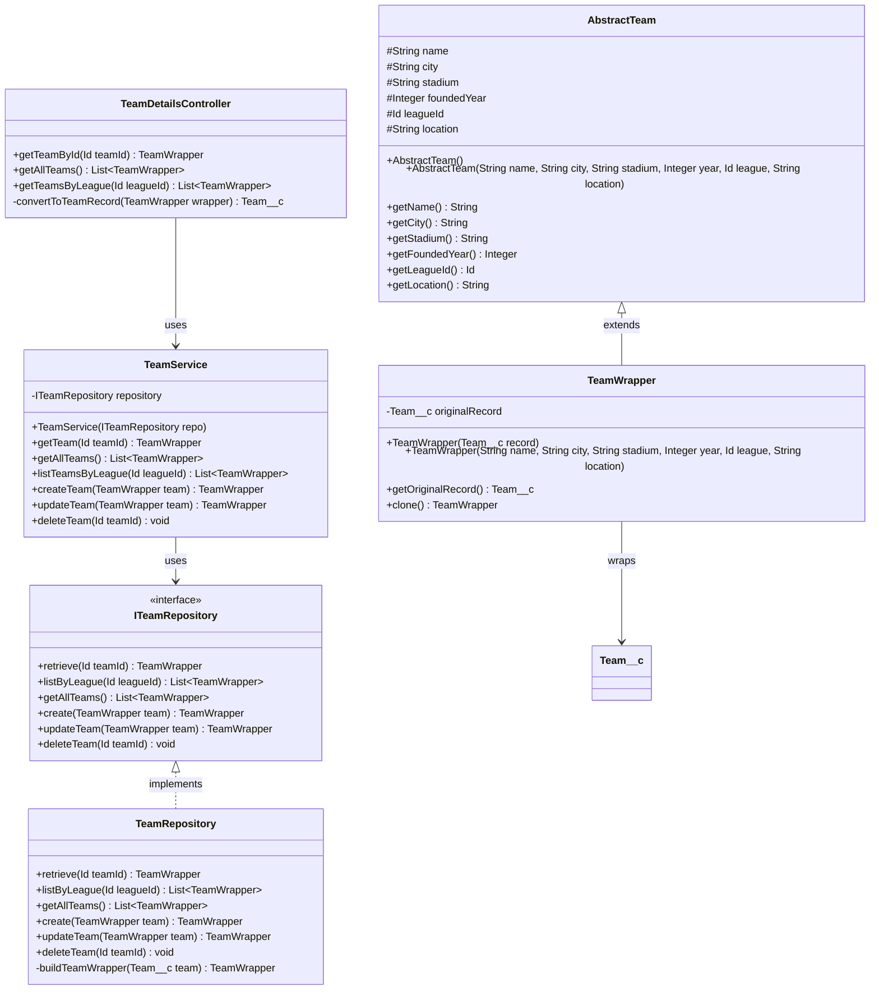

## Salesforce Object Reference Integration

### Understanding Standard vs Custom Objects

Your project uses custom objects but should integrate with standard Salesforce objects:

| Standard Object | Usage in Sports Management | Integration Points |
|----------------|---------------------------|-------------------|
| **User** | Team managers, league administrators | Owner fields, assignment rules |
| **Account** | Team organizations, sponsors | Business relationships |
| **Contact** | Players, coaches, officials | Person records |
| **Event** | Games, practices, meetings | Calendar integration |
| **Task** | Team management activities | Workflow automation |

### Field Types and Best Practices

Your objects use these field types effectively:

| Field Type | Usage | Example | Best Practice |
|------------|-------|---------|---------------|
| **Text** | Names, descriptions | `City__c`, `Stadium__c` | Set appropriate length limits |
| **Number** | Years, scores, counts | `Founded_Year__c` | Use precision/scale correctly |
| **Lookup** | Relationships | `League__c` | Consider cascade behavior |
| **Picklist** | Controlled values | RecordType | Use for standardization |

### Relationship Design Best Practices

Your data model follows Salesforce best practices:

✅ **Good Practices in Your Model**:
- Lookup relationship allows flexibility
- Proper delete constraint (Restrict)
- Meaningful relationship names
- Required fields appropriately marked

✅ **Considerations for Extension**:
- Player__c → Team__c (Many-to-One)
- Game__c → Team__c (Many-to-Many via junction)
- Season__c → League__c (Many-to-One)

### Future Data Model Extensions

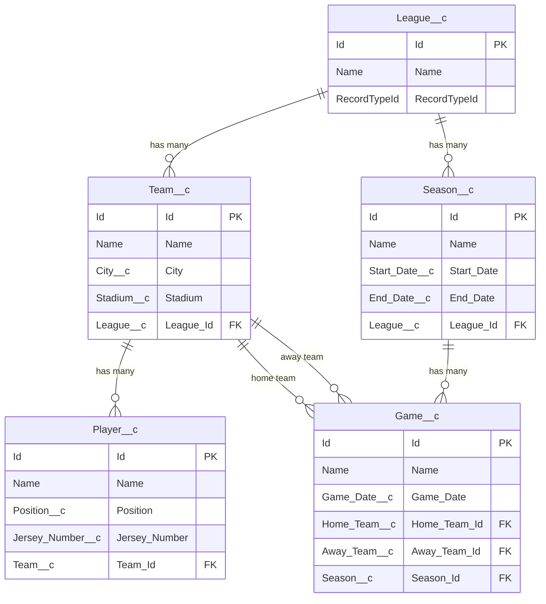

## Practical SF CLI Workflows

### 1. Development Workflow

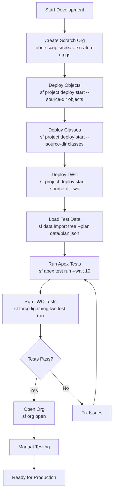

```bash
# 1. Create and setup scratch org
node scripts/create-scratch-org.js sports-dev 30

# 2. Deploy your changes incrementally
sf project deploy start --source-dir sportsmgmt/main/default/objects
sf project deploy start --source-dir sportsmgmt/main/default/classes
sf project deploy start --source-dir sportsmgmt/main/default/lwc

# 3. Load test data
sf data import tree --plan data/league-team-plan.json

# 4. Run tests
sf apex test run --tests TeamRepositoryTest,TeamServiceTest,TeamDetailsControllerTest --wait 10

# 5. Test LWC components
sf force lightning lwc test run

# 6. Open org to verify
sf org open --target-org sports-dev
```

### 2. Data Management Workflow

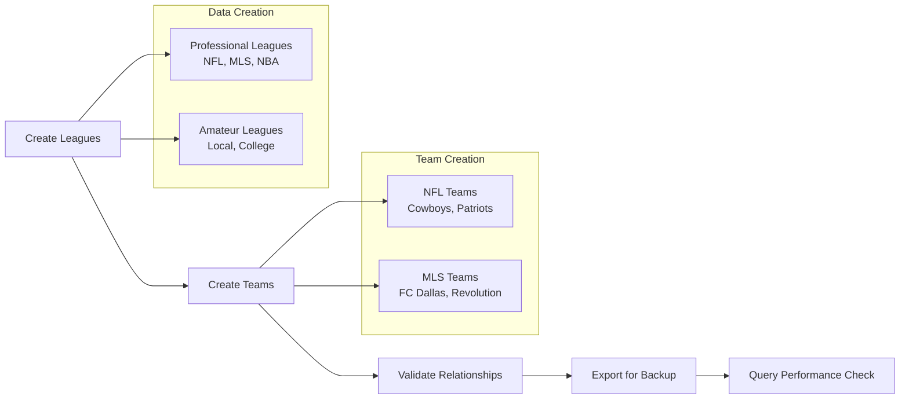

```bash
# Create sample leagues
sf data create record --sobject League__c --values "Name='NFL' RecordTypeId=[Professional_RT_ID]"
sf data create record --sobject League__c --values "Name='MLS' RecordTypeId=[Professional_RT_ID]"

# Create sample teams
sf data create record --sobject Team__c --values "Name='Dallas Cowboys' City__c='Dallas' Stadium__c='AT&T Stadium' Founded_Year__c=1960 League__c=[NFL_ID]"
sf data create record --sobject Team__c --values "Name='New England Patriots' City__c='Foxborough' Stadium__c='Gillette Stadium' Founded_Year__c=1960 League__c=[NFL_ID]"

# Query with relationships
sf data query --query "SELECT Id, Name, City__c, Stadium__c, League__r.Name FROM Team__c WHERE League__r.Name = 'NFL'"

# Export data for backup
sf data export tree --query "SELECT Id, Name, City__c, Stadium__c, Founded_Year__c, League__c FROM Team__c" --output-dir data/backup
```

### 3. Testing and Validation Workflow

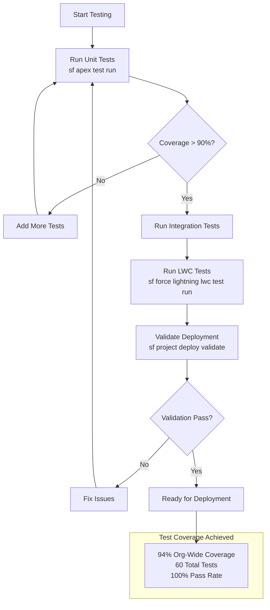

```bash
# Run all tests with coverage
sf apex test run --wait 10 --code-coverage --result-format human

# Run specific test suites
sf apex test run --tests TeamRepositoryTest --wait 10 --code-coverage
sf apex test run --tests TeamServiceTest --wait 10 --code-coverage
sf apex test run --tests TeamDetailsControllerTest --wait 10 --code-coverage

# Run LWC tests
sf force lightning lwc test run --watch

# Validate deployment without deploying
sf project deploy validate --source-dir sportsmgmt

# Check code coverage
sf apex get test --test-run-id [TEST_RUN_ID] --code-coverage
```

### 4. Package Management Workflow

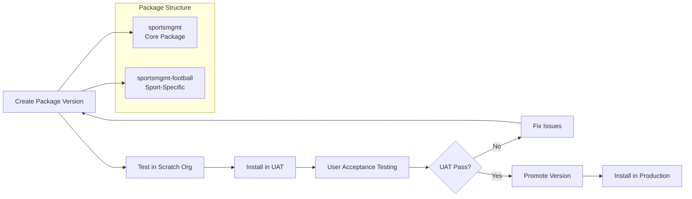

```bash
# Create package versions (using your automation)
./scripts/package-management.sh create-versions --wait 15

# List package versions
sf package version list --package "Sports Management Core"

# Install packages in target org
sf package install --package [PACKAGE_VERSION_ID] --target-org production --wait 10

# Promote package version
sf package version promote --package [PACKAGE_VERSION_ID]
```

## Advanced SF CLI Usage

### Schema Validation and Analysis

```bash
# Describe your objects
sf sobject describe --sobject League__c
sf sobject describe --sobject Team__c

# List all custom objects
sf sobject list --sobject-type custom

# Get detailed field information
sf sobject describe --sobject Team__c --json | jq '.fields[] | {name: .name, type: .type, label: .label}'

# Validate your object relationships
sf data query --query "SELECT COUNT() FROM Team__c WHERE League__c = null"

# Check for orphaned records
sf data query --query "SELECT Id, Name FROM Team__c WHERE League__c NOT IN (SELECT Id FROM League__c)"

# Validate field usage
sf data query --query "SELECT COUNT() FROM Team__c WHERE City__c != null"
sf data query --query "SELECT COUNT() FROM Team__c WHERE Stadium__c != null"
```

### Performance Monitoring

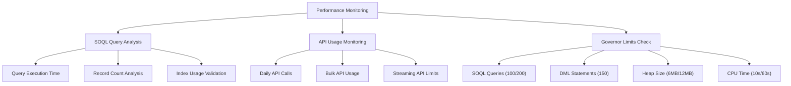

```bash
# Check SOQL query performance
sf data query --query "SELECT Id, Name, (SELECT Id, Name FROM Teams__r) FROM League__c" --perflog

# Monitor API usage
sf org display --target-org sports-dev --json | jq '.result.limits'

# Check governor limits
sf apex run --file scripts/check-limits.apex
```

### Metadata Comparison and Synchronization

```bash
# Compare local vs org metadata
sf project retrieve start --metadata CustomObject:Team__c --target-org sports-dev
sf project deploy validate --source-dir sportsmgmt --target-org sports-dev

# Generate metadata report
sf project deploy report --job-id [DEPLOY_ID]

# Retrieve specific metadata types
sf project retrieve start --metadata CustomObject,CustomField,LightningComponentBundle
```

### Data Quality and Maintenance

```bash
# Find duplicate teams
sf data query --query "SELECT Name, COUNT(Id) FROM Team__c GROUP BY Name HAVING COUNT(Id) > 1"

# Validate data integrity
sf data query --query "SELECT Id, Name FROM Team__c WHERE League__r.Id = null"

# Clean up test data
sf data delete bulk --sobject Team__c --file data/test-teams-to-delete.csv
```

## Best Practices

### 1. Object Design Best Practices

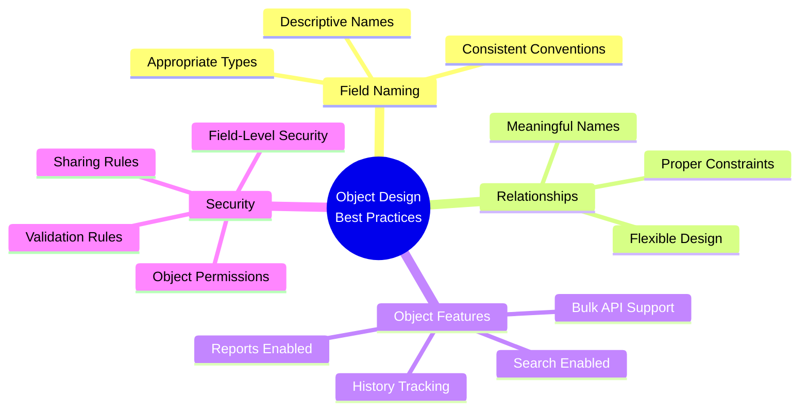

✅ **Field Naming**:
- Use descriptive names: `Founded_Year__c` not `Year__c`
- Follow naming conventions: `City__c`, `Stadium__c`
- Use appropriate field types and lengths

✅ **Relationship Design**:
- Use Lookup for flexible relationships
- Set appropriate delete constraints
- Name relationships meaningfully: `Teams__r`

✅ **Object Features**:
- Enable history tracking for audit trails
- Enable reports for analytics
- Enable search for findability
- Consider bulk API for data loading

### 2. SF CLI Best Practices

✅ **Development Workflow**:
- Use scratch orgs for development
- Deploy incrementally during development
- Run tests frequently
- Use your automated scripts

✅ **Data Management**:
- Use data plans for complex imports
- Export data before major changes
- Validate data integrity regularly
- Use bulk operations for large datasets

✅ **Testing Strategy**:
- Run tests before deployment
- Maintain high code coverage (>90%)
- Test both positive and negative scenarios
- Use dependency injection for mocking

### 3. Performance Optimization

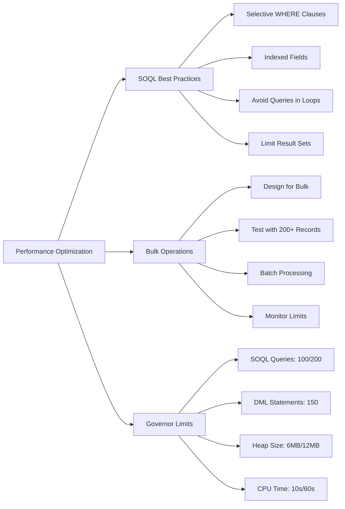

✅ **SOQL Queries**:
- Use selective WHERE clauses
- Avoid queries in loops
- Use indexed fields when possible
- Limit result sets appropriately

✅ **Bulk Operations**:
- Design for bulk processing
- Test with 200+ records
- Use batch processing for large datasets
- Monitor governor limits

### 4. Security and Access Control

✅ **Field-Level Security**:
- Implement proper FLS checks
- Use `with sharing` in Apex classes
- Validate user permissions
- Test with different user profiles

✅ **Data Access**:
- Use appropriate sharing models
- Implement proper access controls
- Validate CRUD permissions
- Test security scenarios

### 5. Test Coverage Achievement

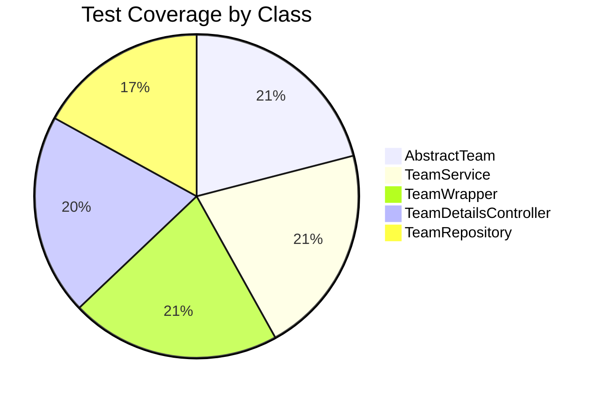

**Current Achievement**: 94% org-wide coverage with 60 total tests

## Useful Commands Reference

### Quick Commands

```bash
# Open current default org
sf org open

# Check current configuration
sf config list

# View org limits
sf org display --json | jq '.result.limits'

# Run quick test
sf apex run --file scripts/quick-test.apex

# Deploy and test in one command
sf project deploy start && sf apex test run --wait 5
```

### Troubleshooting Commands

```bash
# Check deployment status
sf project deploy report --job-id [DEPLOY_ID]

# View recent deployments
sf project deploy report --use-most-recent

# Check test results
sf apex get test --test-run-id [TEST_RUN_ID]

# Validate without deploying
sf project deploy validate --source-dir sportsmgmt
```

### Data Export/Import Templates

```bash
# Export leagues
sf data export tree --query "SELECT Id, Name, RecordType.DeveloperName FROM League__c" --output-dir data/export

# Export teams with relationships
sf data export tree --query "SELECT Id, Name, City__c, Stadium__c, Founded_Year__c, League__c FROM Team__c" --output-dir data/export

# Import with plan
sf data import tree --plan data/league-team-plan.json
```

## Conclusion

This guide provides a comprehensive foundation for working with SF CLI and Salesforce Object Reference in your Sports Management project. Your current architecture follows Salesforce best practices and provides a solid foundation for extension.

### Current Project Status

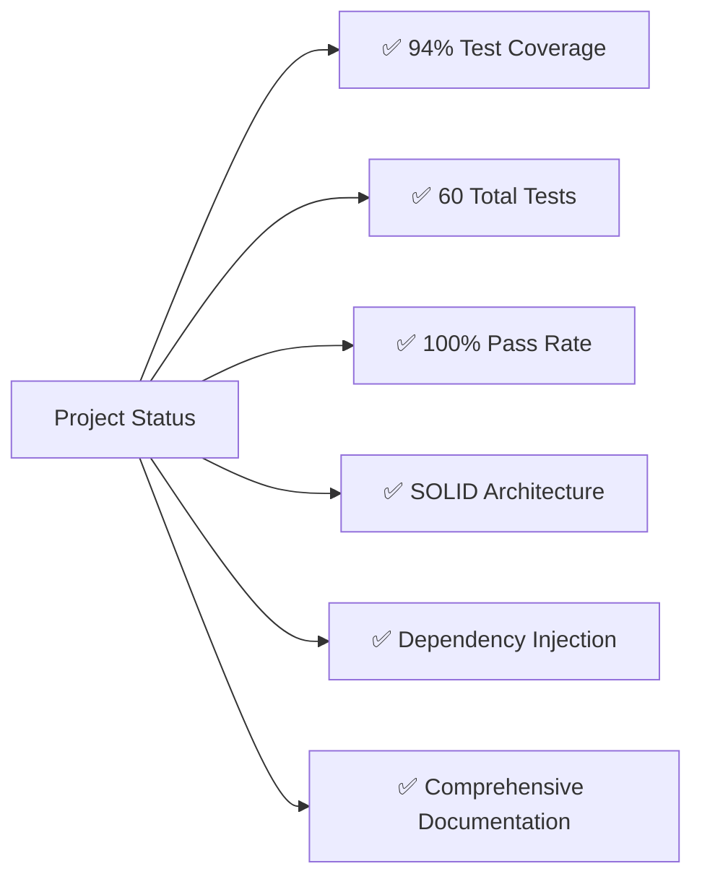

### Next Steps

1. **Extend the Data Model**: Add Player__c, Game__c, Season__c objects
2. **Implement Advanced Features**: Triggers, flows, custom settings
3. **Add Sport-Specific Packages**: Extend the football package
4. **Implement Analytics**: Reports, dashboards, Einstein Analytics
5. **Add Integration**: External APIs, third-party systems

### Resources

- [Salesforce CLI Command Reference](https://developer.salesforce.com/docs/atlas.en-us.sfdx_cli_reference.meta/sfdx_cli_reference/)
- [Salesforce Object Reference](https://developer.salesforce.com/docs/atlas.en-us.object_reference.meta/object_reference/)
- [Salesforce DX Developer Guide](https://developer.salesforce.com/docs/atlas.en-us.sfdx_dev.meta/sfdx_dev/)
- [Lightning Web Components Developer Guide](https://developer.salesforce.com/docs/component-library/documentation/en/lwc)
- [Mermaid Documentation](https://mermaid.js.org/) 