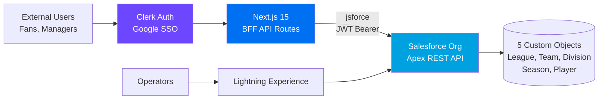
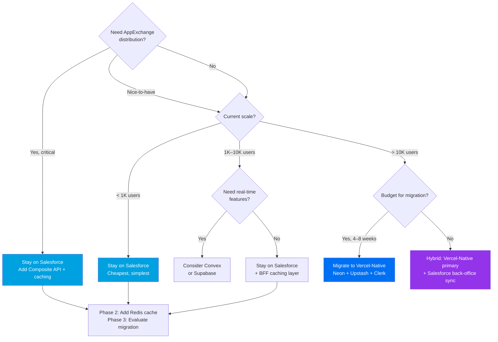
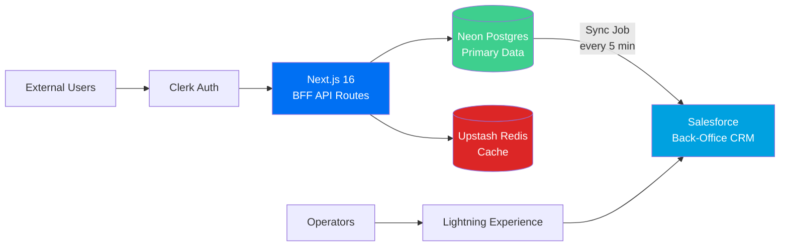

# Backend Cost & Scalability Analysis

**sprtsmng — Sports League Management Platform**
*Last updated: 2026-03-19*

---

## 1. Executive Summary

Salesforce is the right backend for sprtsmng through Year 1 and likely Year 2 — at 1K users with a single Platform license ($25/mo), you get 16,000 API calls/day, enterprise-grade infrastructure, and AppExchange distribution that no alternative offers. The cost is competitive with modern alternatives at this scale. However, Salesforce hits a hard API ceiling around 10K DAU (daily active users) where even Enterprise Edition ($165/mo) caps at ~101K calls/day. The good news: your existing `shared-types` and `api-contracts` packages decouple the frontend from the backend, making a Phase 3 migration to a Vercel-Native stack (Neon + Upstash + Clerk) feasible without rewriting the frontend. **The recommended path is: stay on Salesforce now, add BFF caching in Year 2, and migrate primary data to Vercel-Native by Year 3 while keeping Salesforce as back-office/AppExchange.**

---

## 2. Current Architecture



**Key observation from `salesforce-api.ts`:** The BFF layer makes 15 distinct API functions — each a separate Salesforce REST call. A typical user session (dashboard load) triggers ~5-10 calls: `getLeagues`, `getTeams`, `getDivisions`, `getSeasons`, `getPlayersByTeam`.

---

## 3. Cost Comparison Table

Assumptions:
- **DAU = 30% of total users** (industry average for utility apps)
- **API calls/DAU = 10** (dashboard load + 1-2 drill-downs per session)
- Salesforce: 1 Platform license includes 16,000 API calls/day; additional API calls require more licenses or higher editions
- All prices in USD/month as of March 2026

| Scale | Users | DAU | API Calls/Day | Salesforce | Supabase | Convex | Vercel-Native |
|-------|-------|-----|---------------|------------|----------|--------|---------------|
| **Starter** | 100 | 30 | 300 | **$25** | **$0** | **$0** | **$0** |
| **Growth** | 1K | 300 | 3K | **$25** | **$25** | **$0–25** | **$19–39** |
| **Scale** | 10K | 3K | 30K | **$165–330** | **$75** | **$25–50** | **~$115** |
| **Enterprise** | 100K | 30K | 300K | **BREAKS\*** | **$599** | **$50–200** | **$200–2,000\*\*** |

**\* Salesforce API limit ceiling:** Enterprise Edition includes ~101K API calls/day (base 100K + 1K per license). At 300K raw calls/day you'd need Unlimited Edition ($330/mo) or additional API call packs. However, with Composite API batching (25x multiplier) and BFF caching, Enterprise can support 50K-100K MAU — see Section 7. The "BREAKS" label applies to raw, unoptimized traffic at 100K users.

**\*\* Clerk is the hidden cost bomb:** Clerk charges $0.02/MAU after 10K. At 100K MAUs = ~$1,825/mo, dwarfing all database costs. Consider Auth.js (free, self-hosted) or Clerk's enterprise negotiation at this scale.

### Cost Breakdown by Component

| Component | Starter | Growth | Scale | Enterprise |
|-----------|---------|--------|-------|------------|
| **Salesforce Stack** | | | | |
| SF License | $25 | $25 | $165 | BREAKS |
| Clerk | $0 | $0 | $0 | $0 |
| Vercel | $0 | $20 | $20 | $20 |
| **Supabase Stack** | | | | |
| Supabase | $0 | $25 | $75 | $599 |
| Clerk | $0 | $0 | $0 | $1,825 |
| Vercel | $0 | $20 | $20 | $20 |
| **Convex Stack** | | | | |
| Convex | $0 | $0–25 | $25–50 | $50–200 |
| Clerk | $0 | $0 | $0 | $1,825 |
| Vercel | $0 | $20 | $20 | $20 |
| **Vercel-Native Stack** | | | | |
| Neon Postgres | $0 | $19 | $69 | $69–700 |
| Upstash Redis | $0 | $0 | $10 | $100 |
| Clerk | $0 | $0 | $0 | $1,825 |
| Vercel | $0 | $20 | $20 | $20 |

> **Note:** Salesforce stack uses Clerk only for the external Next.js app (operators use SF auth). Under 10K MAUs, Clerk is free on all stacks.

---

## 4. Cost Trajectory

```mermaid
xychart-beta
    title "Monthly Cost by Platform at Scale"
    x-axis ["100 users", "1K users", "10K users", "100K users"]
    y-axis "Monthly Cost (USD)" 0 --> 2500
    bar [25, 25, 165, 2500]
    bar [0, 25, 75, 2444]
    bar [0, 25, 50, 2045]
    bar [0, 39, 115, 2614]
```



> Bars represent: Salesforce (blue), Supabase (green), Convex (orange), Vercel-Native (purple). At 100K users, Clerk auth ($1,825) dominates all non-Salesforce stacks. Salesforce "BREAKS" is represented as $2,500 to illustrate the cost/feasibility cliff.
>
> **Rendering note:** The `xychart-beta` syntax is experimental in Mermaid and may not render on all GitHub views. If the chart doesn't display, refer to the cost tables in Sections 3 and 5 for the same data.

---

## 5. Platform Deep Dives

### Salesforce API Limits — The Core Constraint

| Edition | Base API Calls/24h | Per-License Bonus | Total (1 license) | Total (5 licenses) |
|---------|-------------------|-------------------|--------------------|---------------------|
| Developer (free) | 15,000 | — | 15,000 | — |
| Platform Starter ($25/user/mo) | ~5,000* | +200/license | ~5,200 | ~6,000 |
| Enterprise ($165/user/mo) | **100,000** | +1,000/license | 101,000 | 105,000 |
| Unlimited ($330/user/mo) | **100,000** | +5,000/license | 105,000 | 125,000 |

\* Platform Starter API allocations vary and are lower than Enterprise. The [Salesforce edition comparison PDF](https://www.salesforce.com/content/dam/web/en_us/www/documents/pricing/salesforce-platform-pricing-editions.pdf) lists 200 REST API calls/day for Platform Starter. Verify against your actual org via `System.OrgLimits.getMap().get('DailyApiRequests')`.

> **Source:** [Salesforce API Limits and Monitoring](https://developer.salesforce.com/blogs/2024/11/api-limits-and-monitoring-your-api-usage), [Limits Cheatsheet](https://developer.salesforce.com/docs/atlas.en-us.242.0.salesforce_app_limits_cheatsheet.meta/salesforce_app_limits_cheatsheet/salesforce_app_limits_platform_api.htm)

**Critical insight:** Enterprise Edition provides **100,000 base API calls/day** — significantly more headroom than Platform Starter. With Composite API (25 sub-requests per call) and BFF caching, Enterprise supports 50K-100K MAU. Platform Starter's low allocation (~200-5,000/day) makes it unsuitable as the sole production license for BFF-heavy traffic.

**Mitigations available:**
- Composite API (25 sub-requests per call) — see Section 7
- BFF response caching (Redis/memory) — dramatically reduces repeat calls
- Bulk API for batch operations (doesn't count against REST limits)

### Which Salesforce Edition Do You Need?

| Edition | Cost/User/Mo | Base API Calls | Custom Objects | Best For |
|---------|-------------|---------------|----------------|----------|
| Developer (free) | $0 | 15,000 | 400+ | Development and testing only — **not for production** |
| Platform Starter | $25 | ~5,000 | 10 | Low-traffic production with minimal API use |
| Platform Plus | $100 | Higher (negotiable) | 110 | Production with moderate API and workflow needs |
| Enterprise (Sales/Service Cloud) | $165 | **100,000** | 200+ | Production SaaS backend with heavy API traffic |

**For sprtsmng's BFF architecture:** Enterprise Edition ($165/user/mo) is the realistic production choice. The 100K base API calls give comfortable headroom for 1K-10K users. Platform Starter ($25/mo) is only viable if you add aggressive BFF caching early.

**Object limit note:** sprtsmng currently has 5 custom objects (League, Team, Division, Season, Player). Platform Starter's 10-object limit works now but leaves only 5 slots for Game, Venue, Registration, Payment, and other future objects. Enterprise has 200+ and is not a concern.

> **Important:** The $165/user/month price is for **Sales Cloud Enterprise** or **Service Cloud Enterprise**, not "Platform Enterprise." Platform-specific pricing (Starter at $25, Plus at $100) is a separate product line with different API allocations. See [Salesforce Platform Pricing](https://www.salesforce.com/editions-pricing/platform/).

### Supabase Pricing

| Tier | Price | Rows Read/mo | Storage | Realtime | Auth |
|------|-------|-------------|---------|----------|------|
| Free | $0 | 500K | 500MB | 200 concurrent | 50K MAU |
| Pro | $25 | 100B | 8GB | 500 concurrent | 100K MAU |
| Team | $599 | 100B | 8GB | 500 concurrent | 100K MAU |

**Strengths:** Built-in auth (Supabase Auth replaces Clerk — eliminates the $1,825/mo cost bomb), real-time subscriptions, edge functions, Postgres flexibility.

### Convex Pricing

| Tier | Price | Document Bandwidth | Actions | Storage |
|------|-------|--------------------|---------|---------|
| Free | $0 | 1GB/mo | 10M/mo | 512MB |
| Pro | $25 | 32GB/mo | 32M/mo | 4GB |
| Enterprise | Custom | Unlimited | Unlimited | Custom |

**Strengths:** Real-time by default, zero-config, TypeScript-native schema, no connection pooling needed. **Weakness:** No SQL — requires remodeling all data access.

### Vercel-Native Pricing (Neon + Upstash + Clerk)

| Component | Free | Pro |
|-----------|------|-----|
| Neon Postgres | 0.5 GB, 1 project | $19/mo — 10 GB, branching, autoscaling |
| Upstash Redis | 10K commands/day | $10/mo — 10M commands/day |
| Clerk Auth | 10K MAU | $0.02/MAU after 10K |
| Vercel | Hobby free | Pro $20/mo |

**Strengths:** Best Vercel integration (auto-provisioned env vars, unified billing), serverless-native, Neon branching for preview deployments. **Weakness:** Assembling multiple services vs. one platform.

### ISV/OEM Licensing (AppExchange Distribution)

If you distribute via AppExchange, the cost model is different from buying your own licenses. See [Salesforce ISV/OEM license comparison](https://developer.salesforce.com/docs/atlas.en-us.202.0.packagingGuide.meta/packagingGuide/oem_user_license_comparison.htm).

| Model | How It Works | Cost to You |
|-------|-------------|-------------|
| **ISVforce** (existing SF customers) | Customer installs your managed package in their own org | **15%** of your app revenue |
| **ISVforce** (new-to-Salesforce) | Customer gets SF licenses bundled | **25%** of your app revenue |
| **OEM Embedded** | You resell SF licenses with your app | $25/user/mo + **25%** revenue share |
| **AppExchange Security Review** | One-time listing fee | **$2,700** |

**Impact at scale:** At 1,000 League-tier customers ($499/yr each = $499K/yr revenue), a 25% ISV share = ~$125K/year to Salesforce. On the 15% tier (existing SF customers), that's ~$75K/year. This should be modeled into long-term unit economics.

**Recommendation:** Use ISVforce for the AppExchange channel (lower share for existing SF customers). For the standalone SaaS channel, run your own production org with purchased licenses to avoid the revenue share entirely. See [teamsnap-competitive-analysis.md](teamsnap-competitive-analysis.md) for the full margin comparison.

---

## 6. Pros & Cons Matrix

| Factor | Salesforce | Supabase | Convex | Vercel-Native |
|--------|-----------|----------|--------|---------------|
| **CRM / Back-office** | ★★★★★ Native | ☆ Build it | ☆ Build it | ☆ Build it |
| **AppExchange** | ★★★★★ Required | ☆ N/A | ☆ N/A | ☆ N/A |
| **API Scalability** | ★★☆ Hard ceiling | ★★★★★ Unlimited | ★★★★★ Unlimited | ★★★★★ Unlimited |
| **Real-time** | ★★☆ Platform Events | ★★★★★ Native subs | ★★★★★ Native | ★★★★ Upstash + SSE |
| **Cost at 1K users** | ★★★★ $25/mo | ★★★★ $25/mo | ★★★★★ $0-25/mo | ★★★★ $19-39/mo |
| **Cost at 100K users** | ★☆ BREAKS | ★★★☆ $599/mo | ★★★★ $50-200/mo | ★★★☆ Clerk-heavy |
| **Developer Experience** | ★★☆ Apex/SOQL | ★★★★ SQL + JS | ★★★★★ TypeScript | ★★★★ Familiar stack |
| **Vercel Integration** | ★★☆ Manual JWT | ★★★★ Marketplace | ★★★☆ Good | ★★★★★ Native |
| **Migration Effort** | — (current) | ★★★☆ Medium | ★★☆ Hardest | ★★★★ Easiest |
| **Compliance (HIPAA etc.)** | ★★★★★ Built-in | ★★★☆ SOC2 | ★★★☆ SOC2 | ★★★☆ Composable |
| **Reporting / Analytics** | ★★★★★ Native reports | ★★☆ SQL queries | ★★☆ Manual | ★★☆ SQL queries |
| **Auth Included** | ★★★★★ SF Identity | ★★★★★ Supabase Auth | ☆ BYO (Clerk) | ☆ BYO (Clerk) |

**Bottom line:** Salesforce's unique value is CRM + AppExchange + compliance. No alternative replaces all three. The question is whether you need all three at scale, or whether a Vercel-Native primary + Salesforce back-office hybrid gives you the best of both.

---

## 7. API Call Budget Analysis

### Calls Per Session (from `salesforce-api.ts`)

A typical user session in sprtsmng:

| Action | API Calls | Frequency |
|--------|-----------|-----------|
| Dashboard load (leagues, teams, divisions, seasons) | 4 | Every session |
| View team details + roster | 2 (getTeam + getPlayersByTeam) | 80% of sessions |
| View player detail | 1 | 50% of sessions |
| Create/update player | 1 | 10% of sessions |
| Update team | 1 | 5% of sessions |
| **Weighted average per session** | **~7 calls** | |

### Daily Budget by Scale

| Scale | DAU | Calls/Day (raw) | With Composite API (÷25) | With BFF Cache (÷5) | Both |
|-------|-----|-----------------|-------------------------|---------------------|------|
| Starter (100 users) | 30 | 210 | 9 | 42 | 2 |
| Growth (1K users) | 300 | 2,100 | 84 | 420 | 17 |
| Scale (10K users) | 3,000 | 21,000 | 840 | 4,200 | 168 |
| Enterprise (100K users) | 30,000 | 210,000 | 8,400 | 42,000 | 1,680 |

### Composite API — The 25x Multiplier

Salesforce's Composite API bundles up to 25 sub-requests into a single API call. The dashboard load (4 calls) becomes 1 Composite call. This effectively gives you:

- **Platform license (16K/day):** serves ~57K raw-equivalent calls/day → supports ~8K DAU
- **With BFF caching on top:** supports ~40K DAU on a single $25 license

**Implementation:** Refactor `salesforce-api.ts` to batch read calls:
```typescript
// Before: 4 separate calls
const [leagues, teams, divisions, seasons] = await Promise.all([
  getLeagues(), getTeams(), getDivisions(), getSeasons()
]);

// After: 1 Composite API call = 4 sub-requests
const dashboard = await compositeRequest([
  { method: 'GET', url: '/leagues', referenceId: 'leagues' },
  { method: 'GET', url: '/teams', referenceId: 'teams' },
  { method: 'GET', url: '/divisions', referenceId: 'divisions' },
  { method: 'GET', url: '/seasons', referenceId: 'seasons' },
]);
```

### BFF Caching Strategy

| Cache Layer | What to Cache | TTL | Impact |
|-------------|--------------|-----|--------|
| **In-memory (Node.js)** | League list, divisions | 5 min | Eliminates ~30% of calls |
| **Upstash Redis** | Team rosters, season data | 2 min | Eliminates ~50% of calls |
| **HTTP Cache-Control** | Static reference data | 10 min | Eliminates repeat loads |
| **Stale-While-Revalidate** | Dashboard data | 1 min stale / 5 min max | Near-zero perceived latency |

**Combined effect:** Composite API + BFF caching reduces effective API consumption by ~80-95%, extending a single Platform license to handle 10K+ users in realistic scenarios.

---

## 8. Migration Effort Table

| Path | Effort | Timeline | Risk | Data Model Change | Frontend Change |
|------|--------|----------|------|-------------------|-----------------|
| **Stay on Salesforce** | None | — | Low (API limits at scale) | None | None |
| **→ Supabase** | Medium | 4–6 weeks | Medium | Recreate 5 tables + RLS | Rewrite BFF routes |
| **→ Convex** | High | 6–10 weeks | High | Remodel to document DB | Rewrite BFF + real-time |
| **→ Vercel-Native** (Neon) | Low–Medium | 3–5 weeks | Low | Recreate 5 tables (SQL→SQL) | Rewrite BFF routes |
| **→ Hybrid** (Vercel + SF sync) | Medium | 5–8 weeks | Medium | Neon primary + SF sync job | Rewrite BFF, add sync |

### Why Vercel-Native Migration is Easiest

1. **`@sprtsmng/shared-types`** defines all DTOs — frontend code doesn't touch Salesforce types directly
2. **`@sprtsmng/api-contracts`** (Zod) validates API boundaries — swap the backend, keep the contracts
3. **Only `salesforce-api.ts` (117 lines) needs rewriting** — replace jsforce calls with Neon queries
4. **SQL→SQL translation** — Salesforce SOQL maps cleanly to Postgres SQL
5. **Same 5 entities** — League, Team, Division, Season, Player are simple relational data

---

## 9. Decision Tree



---

## 10. Phased Recommendation

### Phase 1: Now → End of Year 1 (Stay on Salesforce)

**Action:** Ship on current architecture. Add Composite API batching to `salesforce-api.ts`.

| Item | Detail |
|------|--------|
| Cost | $25/mo Salesforce + $0-20/mo Vercel + $0 Clerk = **$25–45/mo** |
| API headroom | 16K calls/day → with Composite API, ~57K equivalent → supports ~2.5K DAU |
| Effort | ~1 day to implement Composite API wrapper |
| Risk | Low — well within limits for 1K target users |

**Why:** The 1K-user Year 1 target generates ~2,100 raw API calls/day. A single Platform license handles 16,000. You have 7.6x headroom before any optimization.

### Phase 2: Year 2 (Add Read-Replica Cache Layer)

**Action:** Add Upstash Redis as BFF cache. Implement stale-while-revalidate for read-heavy endpoints.

| Item | Detail |
|------|--------|
| Cost | $25 SF + $20 Vercel + $10 Upstash = **$55/mo** |
| API headroom | With caching, effective 80K+ calls/day → supports ~10K DAU |
| Effort | ~1 week to add Redis caching layer |
| Risk | Low — caching is additive, doesn't change data model |

**Why:** At 3K-5K users, you'll start approaching raw API limits. Caching extends Salesforce viability dramatically while you validate product-market fit and revenue growth.

### Phase 3: Year 3+ (Migrate Primary Data to Vercel-Native)

**Action:** Move read/write data to Neon Postgres. Keep Salesforce as back-office CRM + AppExchange listing. Add a sync job (Neon → Salesforce) for operator workflows.

| Item | Detail |
|------|--------|
| Cost | $69 Neon + $20 Vercel + $10 Upstash + Clerk (scale-dependent) = **$99–200/mo** |
| API headroom | Unlimited (Postgres) |
| Effort | 3–5 weeks (rewrite `salesforce-api.ts`, add sync, migrate data) |
| Risk | Medium — data migration requires careful planning |

**Why:** At 10K+ users, Salesforce API limits become a real constraint even with caching. Neon Postgres removes the ceiling entirely. The hybrid approach preserves AppExchange distribution and CRM value for operators.

### Architecture After Phase 3



---

## Appendix: Clerk Cost at Scale

Clerk is the single largest cost risk outside of Salesforce API limits:

| MAU | Monthly Cost | Annual Cost |
|-----|-------------|-------------|
| 10K | $0 (free tier) | $0 |
| 25K | $300 | $3,600 |
| 50K | $800 | $9,600 |
| 100K | $1,825 | $21,900 |

**Alternatives at scale:**
- **Supabase Auth** — included in Supabase plans (free up to 50K MAU on Pro)
- **Auth.js** — free, self-hosted, supports Google/email (requires more engineering)
- **Clerk enterprise negotiation** — volume discounts available at 50K+ MAU

**Recommendation:** Clerk is excellent for launch velocity (already integrated). Plan to evaluate alternatives at 25K MAU when costs reach ~$300/mo. The `@sprtsmng/shared-types` abstraction means auth provider is swappable.

---

## Related Documents

- **[TeamSnap Competitive Analysis](teamsnap-competitive-analysis.md)** — Head-to-head pricing, margin comparison, and competitive viability assessment vs. TeamSnap
- **[User Billing Model](user-billing-model.md)** — User types, auth boundaries, permission set mapping, money flow, and the tier enforcement gap
- **[Excalidraw Diagram](backend-cost-comparison.excalidraw)** — Visual comparison of architecture stacks and cost badges ([PNG](backend-cost-comparison.png))

---

*This analysis is based on published pricing as of March 2026 and API call patterns observed in the sprtsmng codebase. Actual costs may vary based on usage patterns, negotiated pricing, and platform pricing changes.*
