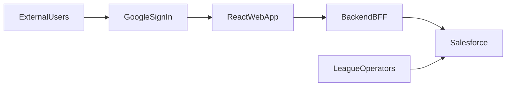
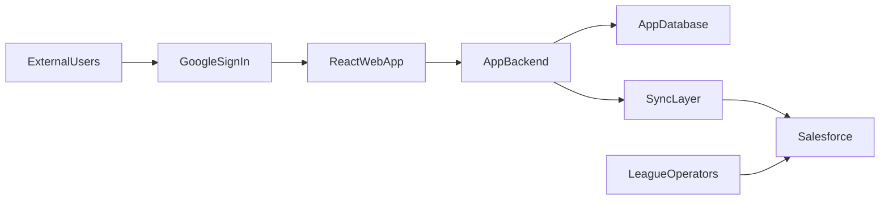

# External Frontend Architecture Options

## Goal

Compare realistic ways to add an external frontend while keeping Salesforce useful for league operators.

## Evaluation Criteria

- external users should not require full Salesforce user provisioning unless there is a clear product reason
- operator workflows in Salesforce should remain reliable
- business rules should not be duplicated across too many layers
- the architecture should support Google sign-in cleanly
- the repository should stay manageable as a product codebase

## Option A: Salesforce System Of Record, External App Through BFF

### Summary

- External users sign into a web app with Google.
- The web app talks to a backend/BFF.
- The backend/BFF talks to Salesforce with a dedicated integration identity.
- Salesforce remains the source of truth for `League__c`, `Team__c`, `Division__c`, `Season__c`, and `Player__c`.

### Flow

### Pros

- Preserves the current Salesforce data model and operator workflows.
- Minimizes disruption to the existing repository.
- Avoids requiring Salesforce users for external customers.
- Creates a clean place to add app-specific authorization rules.
- Lets the external frontend evolve independently from Lightning UI.

### Cons

- Requires a new backend/BFF and API contract.
- Can create latency if every user action routes to Salesforce.
- Business logic reuse may be partial because current controller contracts are Lightning-specific.
- Salesforce becomes an operational dependency for the public app.

### Best fit

Use this if:

- operators remain the primary data stewards
- the external app mostly exposes existing Salesforce-managed data
- the first release needs lower migration risk

## Option B: External App Owns Runtime Data, Salesforce As Back Office

### Summary

- External users sign into a web app with Google.
- The app backend and database own end-user runtime workflows.
- Salesforce receives synced or summarized data for operator visibility and workflow support.

### Flow

### Pros

- Best fit for a product-first web experience with custom workflows.
- Keeps high-frequency user traffic off Salesforce.
- Makes app-specific auth, tenancy, and personalization easier.
- Pairs naturally with Convex or a conventional backend plus database.

### Cons

- Introduces sync complexity and dual-system ownership.
- Requires explicit source-of-truth decisions for each domain object.
- Increases architecture complexity earlier.
- Can duplicate domain rules if boundaries are not designed carefully.

### Best fit

Use this if:

- the external app is becoming the primary product
- user traffic or workflow complexity will outgrow Salesforce-centric patterns
- you want the frontend/backend stack to move faster than Salesforce release cycles

## Option C: Experience Cloud Or Salesforce-Hosted External Access

### Summary

- External users authenticate through Salesforce-supported identity flows.
- External experiences are hosted closer to Salesforce.
- Salesforce continues to own more of the full stack.

### Pros

- Keeps more logic close to current metadata and Apex.
- Can reduce integration layers.
- May simplify some Salesforce-native data access patterns.

### Cons

- Reintroduces Salesforce external-user and licensing concerns.
- Keeps the product more constrained by Salesforce UX and platform patterns.
- Does not match the stated direction of a separate React app very well.
- There is no evidence of Experience Cloud or external auth metadata in the current repo.

### Best fit

Use this if:

- you want Salesforce to host both internal and external experiences
- you are comfortable with Salesforce external identity and experience tooling
- a separate product frontend is not actually a requirement

## Auth And Identity Comparison

| Concern | Option A | Option B | Option C |
|---|---|---|---|
| Google sign-in UX | Strong | Strong | Possible but less central |
| Salesforce user required for external user | No | No | Usually yes, as external user |
| Dedicated integration identity | Yes | Yes | Not necessarily |
| App-side tenancy and scope control | Strong | Strong | Weaker unless heavily customized |
| Reuse of current repo as-is | Medium | Low | High |

## Data Ownership Comparison

| Concern | Option A | Option B | Option C |
|---|---|---|---|
| Salesforce owns current five custom objects | Yes | Partial or no | Yes |
| Dual-write/sync complexity | Low | High | Low |
| Fit for realtime app behavior | Medium | High | Low to medium |
| Fit for back-office reporting in Salesforce | High | High | High |

## Monorepo Compatibility

All three options can live in a monorepo, but the strength of the case differs:

- Option A benefits from a monorepo if the team wants shared contracts, shared auth docs, and coordinated backend plus web development.
- Option B benefits the most because the app stack becomes a true multi-package software product.
- Option C has the weakest need because most work remains inside Salesforce metadata.

## Recommendation

Use Option A as the near-term target and evaluate Option B only if the external app is expected to become the primary product surface.

Why Option A is the best first move for this repository:

- It preserves the current Salesforce-centered data model.
- It avoids forcing external users into Salesforce.
- It introduces the missing app-side authorization boundary.
- It gives the team time to learn where Salesforce should remain authoritative and where an app database might later make sense.

## What To Avoid

- Do not expose current `@AuraEnabled` controllers directly to the public app.
- Do not use an over-privileged operator permission set as the integration identity.
- Do not decide on Convex only because it is convenient; first decide whether app-owned data is actually required.
